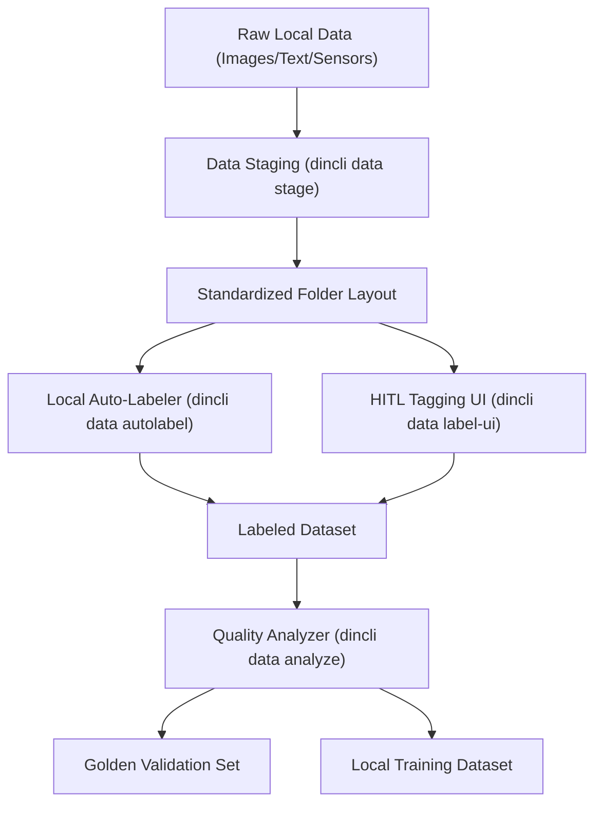

# Client Labeling & Data Preparation Tooling

## Summary

Training a federated learning model assumes that client devices contain high-quality, labeled local datasets. In practice, raw client data is unstructured, unorganized, and unlabeled. 

To bridge this gap, `dincli` should provide data preparation and labeling tools. These tools run locally on the client's device, ensuring that raw files can be processed, labeled, and validated before being fed into the training loop, without exposing raw data to the network.

---

## Architecture of Client Data Tooling

The proposed client data utilities will live inside `dincli` and compose three primary modules:



---

## Core Tooling Capabilities

### 1. Data Staging (`dincli data stage`)

Raw files on client devices are often scattered. The staging tool:
- Scans directories containing raw data (e.g., JPEG, PNG, TXT, CSV).
- Verifies integrity, strips metadata (EXIF tags for privacy), and resizes or normalizes features.
- Places them into a structured local sandbox directory.

**Example Command:**
```bash
dincli data stage --input ~/Pictures/raw_camera --output ~/.din/tasks/task_0xabc/data
```

---

### 2. Local Auto-Labeler (`dincli data autolabel`)

For tasks using semi-supervised or weak supervision modes, the auto-labeler leverages the latest aggregated global model or a lightweight edge foundation model.

- **Operation**: It runs batch inference on the staged raw data locally.
- **Output**: Generates a local sqlite db or `labels.json` containing predicted class, confidence scores, and entropy.
- **Filtering**: Filters out samples below a manifest-defined threshold (e.g., `confidence < 0.85`), moving them to an "unlabeled pool" for active learning.

**Example Command:**
```bash
dincli data autolabel \
  --data ~/.din/tasks/task_0xabc/data \
  --model-cid bafy_global_model_v4 \
  --threshold 0.85
```

---

### 3. Human-in-the-Loop Tagging Interface (`dincli data label-ui`)

For active learning or manual verification, clients need a clean, zero-config local user interface.

- **Local Server**: Launches a lightweight localhost web server (e.g., Flask/FastAPI + React) or an interactive terminal UI.
- **Active Learning Queue**: Serves samples sorted by prediction uncertainty (highest entropy first).
- **Golden Set Creation**: Allows users to explicitly flag a subset of high-confidence samples as part of the "local golden validation set."

**Example Command:**
```bash
dincli data label-ui --port 8080 --data ~/.din/tasks/task_0xabc/data
```

---

### 4. Local Quality Analyzer (`dincli data analyze`)

Before starting a training round, this utility runs diagnostic tests on the labeled data to prevent local training failure or aggressive gradient updates:

- **Imbalance Check**: Flags if class distribution has a Gini coefficient close to 1 (indicating collapse).
- **Label Noise Estimation**: Computes average entropy of auto-labels.
- **Sanity Checks**: Verifies that images/text samples are not corrupted and that label files match the feature indices.

**Example Command:**
```bash
dincli data analyze --data ~/.din/tasks/task_0xabc/data
```

---

## Service Builder Integration

When a model owner uses the `dincli build services` command, the generated client service files (`client.py`) should incorporate these utilities into the training lifecycle.

In the `service-builder.yaml` file, the model owner can declare the data-prep pipeline:

```yaml
services:
  client:
    data_prep:
      auto_labeling:
        enabled: true
        mode: consistency_regularization
        threshold: 0.90
        unlabeled_fallback: active_learning
      validation:
        min_samples: 50
        max_class_imbalance_ratio: 10.0
        require_golden_set: true
```

The generated `client.py` will read these rules, automatically run `autolabel` and `analyze` steps at the start of each global iteration, and only proceed to local model training if the data passes the validation checks. If it fails, the client reports a `DATA_PREP_FAILED` error rather than training on bad data and submitting a corrupted model update.
