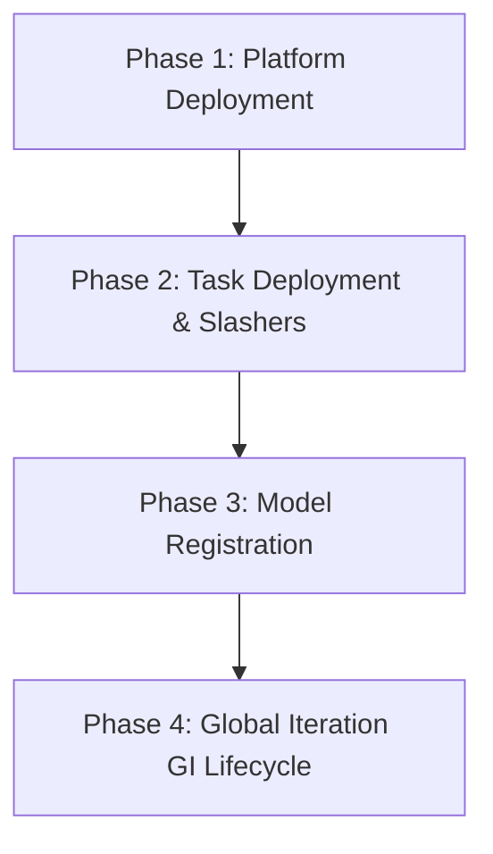

# dincli Integration Test Guide

This guide explains how to run the `tests/dincli/` integration test harness
against a local Hardhat node, and documents the architecture of the harness
itself.

---

## Quick start

The harness is self-contained. All prerequisites (contract compilation, Hardhat
node, IPFS daemon) are managed automatically by the conftest. The only manual
requirement is Docker — it must be running before Phase 4 client training begins.

```bash
# 1. Ensure Docker daemon is running
sudo systemctl start docker   # or Docker Desktop

# 2. Run the full harness (fail-fast, recommended)
cd /home/azureuser/projects/devnet
source /home/azureuser/my_venvs/pyDIN/bin/activate
pytest tests/dincli/ -v -x -m integration --tb=short 2>&1 | tee /home/azureuser/tempdir/dincli/results/last_run.txt
```

That's it. The conftest will:
- Compile all Solidity contracts via `npx hardhat compile`
- Kill any existing Hardhat node and start a fresh one (clean EVM state)
- Start the IPFS daemon if it is not already running
- Restore `dincli/config/din_info.json` to its committed state after the run

---

## Test architecture (`conftest.py`)

The test suite is structured around a centralized session-scoped `conftest.py`
that isolates dependencies and coordinates services.

### Managed services (`managed_services` fixture)

Before any test runs, the fixture does the following:
1. **Solidity compilation** — runs `npx hardhat compile` inside
   `/home/azureuser/projects/devnet/hardhat` to generate fresh contract ABIs.
2. **Fresh Hardhat node** — kills any active node process on port `8545` and
   launches a clean local node (`npx hardhat node`) with the customized
   account count.
3. **IPFS daemon** — checks if the IPFS API (`http://127.0.0.1:5001`) is
   running, starting it (`ipfs daemon`) if not. If it was already running
   externally, it is left running at teardown.
4. **Docker daemon** *(pre-requisite, not managed)* — must already be running
   on the host to execute containerized client training, evaluation, and
   aggregation in Phase 4.

### Config and state isolation

The conftest redirects `XDG_CONFIG_HOME` and `XDG_CACHE_HOME` to
`/home/azureuser/tempdir/dincli/`, so it never touches `~/.config/dincli` or
`~/.cache/dincli`. Your real wallet and network config are untouched.
`config/` and `cache/` are wiped at the start of each session; `results/`
accumulates across runs.

If a run is interrupted (e.g. Ctrl-C) before session teardown restores
`din_info.json`:

```bash
git checkout dincli/config/din_info.json
```

### Python environments

Two Python environments are used. The conftest's `run()` helper switches
between them automatically per command — no manual activation needed:

| Environment | Path | Used for |
|-------------|------|----------|
| `pyDIN` | `/home/azureuser/my_venvs/pyDIN/bin/python` | All CLI commands except those requiring torch/numpy |
| `torchenv` | `/home/azureuser/my_venvs/torchenv/bin/python` | Genesis model creation, client training, auditor evaluation, aggregation, MNIST distribution |

`TORCHENV_PYTHON` / `PYDIN_PYTHON` are defined in `tests/dincli/constants.py`.
If you see torch import errors in Phase 4, confirm those paths are correct.

### Hardhat accounts

The GI harness uses accounts 0–22 and 50–58 (59 accounts total). Hardhat's
default is 20 accounts. `hardhat.config.ts` must have `accounts.count` set to
at least 60. If you see an "account index out of range" error:

```ts
// hardhat/hardhat.config.ts
networks: {
  hardhat: {
    accounts: {
      count: 70,
    },
    ...
  }
}
```

Then re-export `accounts.json`:

```bash
cd hardhat
npx hardhat export-accounts
```

---

## Test phases

The test harness runs linearly; each phase depends on state created by the
previous ones.



| Phase | File | Description |
|-------|------|--------------|
| 1 | `test_01_platform.py` | Deploy 4 platform contracts as DIN-Representative (account 0) |
| 2 | `test_02_task_contracts.py` | Deploy task contracts + authorise slashers (accounts 0 and 1) |
| 3 | `test_03_registration.py` | Genesis model creation, IPFS upload, registry request + approval |
| 4 | `test_04_gi.py` | Full Global Iteration: aggregator/auditor/client/eval/aggregation/slash/end |

The harness is the blocking prerequisite for contract upgrade redeployments
(P3 WP 6.1). Pass all phases before pushing contract changes to testnet.

### Phase 1: Platform Deployment (`test_01_platform.py`)
- **Role**: `Account 0` (DIN-Representative).
- **Deploys**: `DinCoordinator` (and `DinToken` internally), `DinValidatorStake`,
  `DINModelRegistry`.
- **Outputs**: official ABIs and platform contract addresses, stored in the
  shared session `state`.

### Phase 2: Task & Slasher Setup (`test_02_task_contracts.py`)
- **Role**: `Account 1` (Model Owner).
- **Deploys**: `DINTaskCoordinator`, `DINTaskAuditor`.
- **Authorizations**: `Account 0` authorizes the new task contracts as
  legitimate slashers; the model owner then registers the slashers back onto
  the task contracts.

### Phase 3: Genesis Model & Registration (`test_03_registration.py`)
- **Role**: Model Owner & DIN-Representative.
- **Flow**:
  1. Creates per-task local workspace directories.
  2. Caches base dependencies/artifacts from IPFS.
  3. Generates local genesis weights (PyTorch, `torchenv`).
  4. Uploads the genesis model to IPFS and submits its hash on-chain.
  5. Updates the project manifest with the new CIDs and submits registration.
  6. `Account 0` inspects and approves the registration request.

### Phase 4: Global Iteration (GI) Lifecycle (`test_04_gi.py`)
The core federated training round:
1. **Window opening** — opens registration for aggregators and auditors.
2. **Staking & joining** — 12 aggregators (accounts `11–22`) and 9 auditors
   (accounts `50–58`) buy DIN tokens, stake, and register.
3. **Training (LMS)** — a distributed MNIST shard dataset is generated and
   assigned to 9 clients (accounts `2` and `4–10`); clients run local
   training inside containerized workers (Docker) and upload model weights.
4. **Evaluation** — auditors receive partitioned batches of trained local
   models, evaluate accuracy against test data, and submit scores on-chain.
5. **Aggregation** — aggregators pull approved weights and perform Tier 1
   (sub-batch averaging) and Tier 2 (global consensus model) aggregation.
6. **Slashing & cleanup** — under-performing validators are slashed and the
   Global Iteration is ended.

---

## Containerized workers (Phase 4)

`client train-lms`, `auditor lms-evaluation evaluate`, and
`aggregator aggregate-t1`/`aggregate-t2` all delegate to
`dincli/cli/worker.py`, which runs the model owner's service code inside a
`din-worker:dev` Docker container (`run_worker_container`). The image itself
only ships `rich` (see `dincli/docker/worker/Dockerfile`) — everything else a
service needs must come from the mounted packages directory.

### Package installation vs. `--packages-dir`/`--no-cache`

By default, each role installs the manifest's pinned `requirements.txt` into a
cache directory (`get_worker_packages_dir`) keyed by content hash, then mounts
that directory read-only into the container at `/din/packages` with
`PYTHONPATH=/din/packages`. Two flags change this:

- `--packages-dir <path>` — mount an already-prepared directory instead of
  installing from the manifest's `requirements.txt`. Useful for pointing the
  worker at an existing venv's `site-packages` to avoid a multi-GB reinstall
  per test run.
- `--no-cache` — skip the install step entirely (the worker runs without a
  freshly-built packages cache).

When either is set, `ensure_worker_packages_installed` is skipped and the
given directory (or `None`) is passed straight through to
`run_worker_container`.

`dincli` itself is **not** an architectural requirement of the mounted
packages directory: the reference `auditor.py`/`aggregator.py` services never
import `dincli` (they rely entirely on dincli pre-fetching every IPFS-addressed
input host-side before the container runs — see the comments in those files).
If a worker container fails with `ModuleNotFoundError: No module named
'dincli'`, check the service file for a *dead* top-level `from dincli...`
import first — `cache_model_0/services/client.py` previously imported
`retrieve_from_ipfs`, `upload_to_ipfs`, `CONFIG_DIR`, `get_w3`, `get_config`
from `dincli` without ever using them, which broke under any packages
directory that doesn't happen to include `dincli` (such as a plain
`torchenv` `site-packages`). The fix is to remove the unused import from the
service file, not to bundle `dincli` into the packages directory.

### Silent worker failures

`dincli/docker/worker/worker.py` (the container entrypoint) catches *any*
exception raised by the service function, writes `{"status": "error", ...}`
plus a full traceback to `result.json`, and exits `1`. The CLI commands check
`docker_result.returncode` first and raise `typer.Exit` before ever reading
`result.json` on a nonzero exit — so the real error (import errors, missing
files, etc.) only shows up if you inspect the job's output file directly:

```
<model_base_dir>/jobs/<role>/<address>/<job_name>_output/result.json
```

This is the first place to look when a worker container "fails" with no
useful stdout/stderr in the CLI output.

### Sibling-module service dependencies

Reference services that `sys.path.append` their own directory to import
sibling modules (e.g. `services/auditor.py` importing `from scoring import
...`) require every sibling module to have its own manifest entry and its own
`ensure_file_exists()` fetch in the CLI command — the same pattern already
used for `ModelArchitecture`. This is handled for `scoring.py` via the
`"ScoringUtils"` manifest key, fetched in `evaluate_lms`
(`dincli/cli/auditor.py`) alongside the auditor and model service files:

```python
scoring_manifest = get_manifest_key(effective_network, "ScoringUtils", model_id)
scoring_service_path = model_base_dir / Path(scoring_manifest["path"])
ctx.obj.ensure_file_exists(scoring_service_path, scoring_manifest["ipfs"], "scoring utils")
```

When adding a new reference service with sibling-module imports, follow this
pattern: add a manifest entry with its own IPFS CID, and fetch it explicitly
before the worker job runs.

---

## Useful variants

```bash
# Single phase
pytest tests/dincli/test_01_platform.py -v -m integration

# Show subprocess stdout inline (useful for debugging a failure)
pytest tests/dincli/ -v -x -m integration -s

# Re-run from a specific test without restarting services (NOT recommended —
# every test depends on all previous tests having run in the same session)
pytest tests/dincli/test_04_gi.py::test_gi_start -v -m integration
```

> [!IMPORTANT]
> Because every test depends on the blockchain transactions and files created
> by preceding steps, tests must be run in order. Using `-x` (fail-fast) is
> highly recommended so pytest stops immediately on the first failure.

---

## Output / logs

All output is written to `/home/azureuser/tempdir/dincli/`:

| Path | Contents |
|------|----------|
| `results/last_run.txt` | Full pytest output of the most recent run |
| `results/hardhat_compile.log` | `npx hardhat compile` output |
| `results/hardhat_node.log` | Hardhat node stdout/stderr |
| `results/ipfs_daemon.log` | IPFS daemon stdout/stderr (if started by conftest) |
| `config/` | Isolated dincli config for the test session |
| `cache/` | Isolated dincli cache for the test session |

---

## Troubleshooting

**Docker not running** — Phase 4 client training uses containerised execution.
Start Docker before running the suite.

**Hardhat node failed to start** — check
`/home/azureuser/tempdir/dincli/results/hardhat_node.log`.

**IPFS not responding** — check
`/home/azureuser/tempdir/dincli/results/ipfs_daemon.log`.
If the daemon was already running externally it will not be stopped at teardown.

**`din_info.json` dirty after interrupted run** —
`git checkout dincli/config/din_info.json`.

**Torch import errors in Phase 4** — confirm `TORCHENV_PYTHON` in
`tests/dincli/constants.py` points to the correct venv Python binary.

**Worker container "failed" with no error text** — see
[Silent worker failures](#silent-worker-failures) above; inspect the job's
`result.json` directly.

**`ModuleNotFoundError: No module named 'dincli'` inside a worker container**
— check for a dead/unused top-level `dincli` import in the service file
before assuming `dincli` needs to be bundled into the packages directory; see
[Package installation vs. `--packages-dir`/`--no-cache`](#package-installation-vs---packages-dir---no-cache).

---

## Relationship to the SDK extraction (P4 WP 1.2)

Each test function carries a `SDK candidate:` comment that names the function
that will eventually live in `dincli/sdk/`. See `tests/dincli/NOTES.md` for
the full SDK candidate map. When P4 begins the SDK extraction, these notes
become the interface specification.

This guide also serves as a specification for the upcoming
**CLI vs. SDK separation boundary** (extracting pure Web3/IPFS logic to
`dincli/sdk/` while keeping console UI in `dincli/cli/`).
